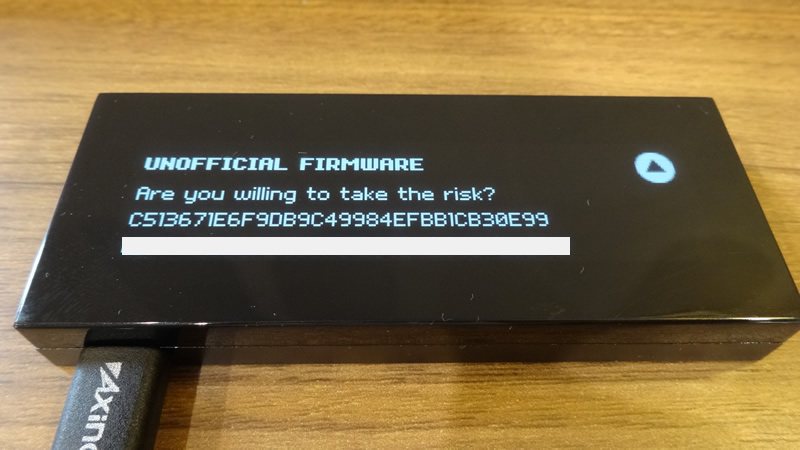

# HOW TO INSTALL KEEPKEY WALLET FIRMWARE

## OUTLINE
This page is a guideline for installing OmotenashiCoin firmware on Keepkey hardware devices.  
Keepeky device can be used as a wallet of OmotenashiCoin by installing MTNS firmware according to the following procedure.  
As of February 2020, Keepkey does not yet officially support OmotenashiCoin.  
If you want to install custom firmware, see this page.  
This step is not necessary after Keepkey has officially supported OmotenashiCoin.  
These update environments are performed on Ubuntu 18.04.  
## IMPORTANT INFOMATIONS
<span style="color: red; ">
If you already have other coin funds in your KEEPKEY wallet,  
be sure TO TRANSFER THE FUNDS TO ANOTHER WALLET.  
Please use only those who have accepted the [terms of use / disclaimer](http://users-manual.org/disclaimer/ "terms of use / disclaimer").
</span>


## INSTALL KEEPKEY CLI TOOL
```
$ sudo pip3 install keepkey
:
:
Requirement already up-to-date: mnemonic>=0.8 in /usr/local/lib/python3.6/dist-packages (from keepkey)
Collecting hidapi>=0.7.99.post15 (from keepkey)
Requirement already up-to-date: libusb1>=1.6 in /usr/local/lib/python3.6/dist-packages (from keepkey)
Requirement already up-to-date: six>=1.9.0 in /usr/local/lib/python3.6/dist-packages (from ecdsa>=0.9->keepkey)
Collecting setuptools (from protobuf>=3.0.0->keepkey)
  Downloading https://files.pythonhosted.org/packages/3d/72/1c1498c1e908e0562b1e1cd30012580baa7d33b5b0ffdbeb5fde2462cc71/setuptools-45.2.0-py3-none-any.whl (584kB)
    100% |????????????????????????????????| 593kB 1.9MB/s 
Installing collected packages: setuptools, protobuf, hidapi
  Found existing installation: setuptools 45.1.0
    Uninstalling setuptools-45.1.0:
      Successfully uninstalled setuptools-45.1.0
  Found existing installation: protobuf 3.11.2
    Uninstalling protobuf-3.11.2:
      Successfully uninstalled protobuf-3.11.2
  Found existing installation: hidapi 0.7.99.post21
    Uninstalling hidapi-0.7.99.post21:
      Successfully uninstalled hidapi-0.7.99.post21
Successfully installed hidapi-0.9.0.post2 protobuf-3.11.3 setuptools-45.2.0
```

## DOWNLOAD AND INSTALL OFFICIAL BOOTLOADER  FIRMWARE FOR KEEPKEY
### Downlaod keepkey firmware 
Now to update keepkey firmware to virsion 2.  
The reason is that only firmware version 2 or higher supports custom firmware.
```
$ wget https://github.com/keepkey/keepkey-firmware/releases/download/bl_v2.0.0/binaries.tar.bz2
$ tar xvf binaries.tar.bz2 
$ cd bin/
$ ls
blupdater.bin  bootloader.bin  firmware.keepkey.bin
blupdater.elf  bootloader.elf  firmware.keepkey.elf
```
### Install official keepkey firmware
1. go back to your pc. Connect to your PC with firmware update mode.  
**  Keep pushing the button down ** on your keepkey device upper, then connect the USB cable it will start in firmware update mode. 


2. Enter keepkeyctl command.  
`$ keepkeyctl firmware_update -f blupdater.bin`

3. display message  
If you press and hold the button on the keepkey body,  
the [▲] image on the screen changes to [ ﾚ ] and the screen moves to the next screen.  


Now dissconnect usb cable from your Keepkey wallet, and reconnect.

4. Update keepkey firmware .  
press and hold the button on the keepkey body.  


Now dissconnect usb cable from your Keepkey wallet, and reconnect.


## INSTALL MTNS FIRMWARE TO KEEPKEY WALLET

### Download MTNS firmware for a keepkey device from our github web url.
```
$ wget https://github.com/omotenashicoin-project/OmotenashiCoin-HDwalletbinaries/raw/master/stable/keepkey_firmware.tar.gz
$ tar zxvf keepkey_firmware.tar.gz
$ ls
firmware.keepkey.bin
```

### Install custom MTNS  keepkey firmware
1. dissconnect usb cable from your Keepkey wallet, and reconnect.  
display message: 


2. Enter keepkeyctl command.  
` $ keepkeyctl firmware_update -f firmware.keepkey.bin`

3. Go back your keepkey device.  
press and hold the button on the keepkey body.  


dissconnect usb cable from your Keepkey wallet, and reconnect.
After the update, an unofficial firmware warning is displayed.  
hold down the right button on your Keepkey wallet.   

After a while, the following screen is displayed.  


MTNS firmware install success.

To use Keepkey now, go to this URL
[Hardware Wallet (Keepkey))](http://users-manual.org/hd_keepkey_wallet/ "Hardware Wallet (Keepkey))")


