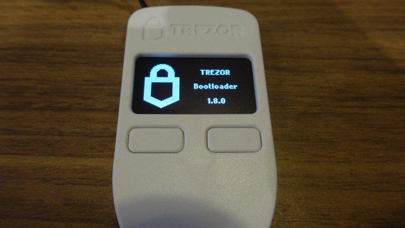
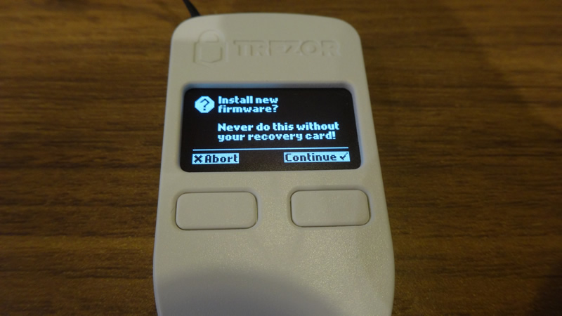
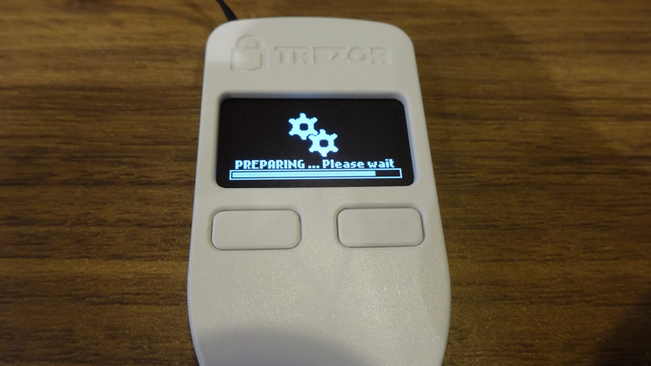
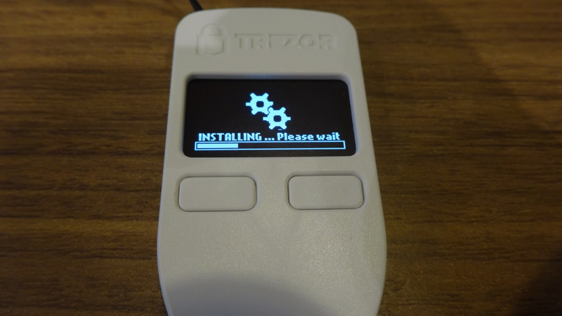
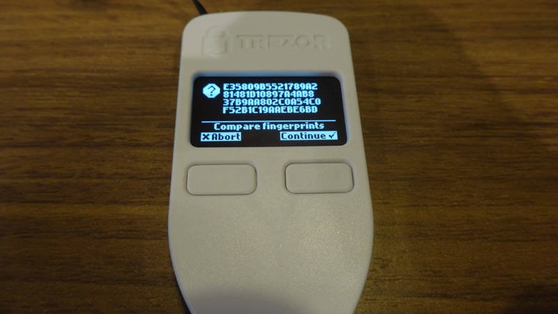
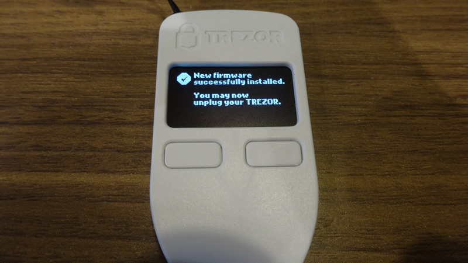
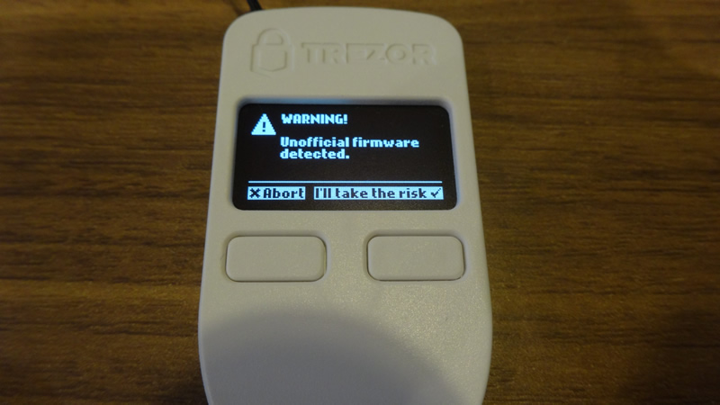
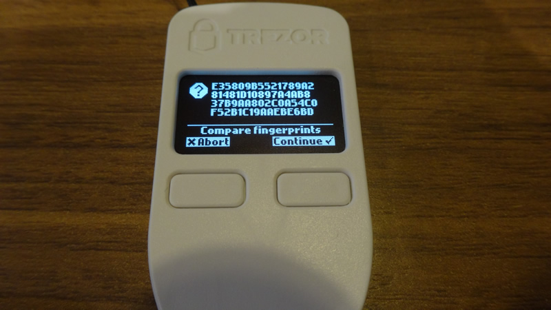
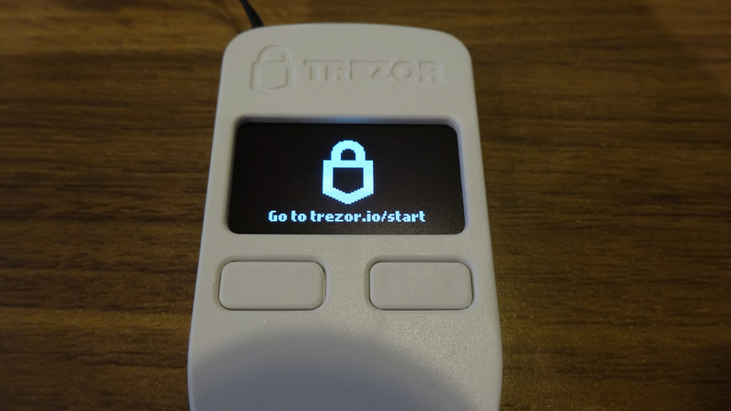

# HOW TO INSTALL TREZOR WALLET FIRMWARE

## OUTLINE
This page is a guideline for installing OmotenashiCoin firmware on Trezor hardware devices.  
Trezor device can be used as a wallet of OmotenashiCoin by installing MTNS firmware according to the following procedure.  
As of February 2020, Trezor does not yet officially support OmotenashiCoin.  
If you want to install custom firmware, see this page.  
This step is not necessary after Trezor has officially supported OmotenashiCoin.  
These update environments are performed on **Ubuntu 18.04 for Trezor One with bootloader version 1.8.0**.  
**We have not confirmed the operation of Trezor Model T.**  
## IMPORTANT INFOMATIONS
<span style="color: red; ">
If you already have other coin funds in your TREZOR wallet,  
be sure TO TRANSFER THE FUNDS TO ANOTHER WALLET.  
Please use only those who have accepted the [terms of use / disclaimer](http://users-manual.org/disclaimer/ "terms of use / disclaimer").
</span>


## INSTALL TREZOR CLI TOOL
```
$ sudo pip3 install trezor
:
:
Requirement already up-to-date: mnemonic>=0.8 in /usr/local/lib/python3.6/dist-packages (from trezor)
Collecting hidapi>=0.7.99.post15 (from trezor)
Requirement already up-to-date: libusb1>=1.6 in /usr/local/lib/python3.6/dist-packages (from trezor)
Requirement already up-to-date: six>=1.9.0 in /usr/local/lib/python3.6/dist-packages (from ecdsa>=0.9->trezor)
Collecting setuptools (from protobuf>=3.0.0->trezor)
  Downloading https://files.pythonhosted.org/packages/3d/72/1c1498c1e908e0562b1e1cd30012580baa7d33b5b0ffdbeb5fde2462cc71/setuptools-45.2.0-py3-none-any.whl (584kB)
    100% |????????????????????????????????| 593kB 1.9MB/s 
Installing collected packages: setuptools, protobuf, hidapi
  Found existing installation: setuptools 45.1.0
    Uninstalling setuptools-45.1.0:
      Successfully uninstalled setuptools-45.1.0
  Found existing installation: protobuf 3.11.2
    Uninstalling protobuf-3.11.2:
      Successfully uninstalled protobuf-3.11.2
  Found existing installation: hidapi 0.7.99.post21
    Uninstalling hidapi-0.7.99.post21:
      Successfully uninstalled hidapi-0.7.99.post21
Successfully installed hidapi-0.9.0.post2 protobuf-3.11.3 setuptools-45.2.0
```

## INSTALL MTNS FIRMWARE TO TREZOR WALLET

### Download MTNS firmware for a trezor device from our github web url.
```
$ wget https://github.com/omotenashicoin-project/OmotenashiCoin-HDwalletbinaries/raw/master/stable/trezor_firmware.tar.gz
$ tar zxvf trezor_firmware.tar.gz
$ ls
trezor.bin
```

### Install custom MTNS  trezor firmware
1. Connecting USB cable while holding down the 2 buttons (right and left buttons simultaneously) of the Trezor.  
The boot loader screen will be displayed.
display message: 


2. Enter trezorctl command.  
` $ trezorctl firmware-update -f trezor.bin`
> After executing the command, the following information is displayed on the command line.  
> Enter "y" in the "No signatures found. Continue? [Y / N]" line and enter.  
>> Trezor One v2 firmware (1.8.0 or later)  
Firmware version 1.9.0 build 0  
**No signatures found. Continue? [y/N]: y**  
Unsigned firmware looking OK.  
Firmware fingerprint: e35809b5521789a281481d10897a4ab837b9aa802c0a54c0f52b1c19aaebe6bd  
Please confirm action on your Trezor device  
Please confirm action on your Trezor device    
3. Go back your trezor device.  
Push the right button on the trezor body.  
  
Push right button. will be started firmware instration. 


Push the right button on the trezor body.  


4. Disconnect usb cable from your trezor device, then reconnect.
5. A warning is displayed for custom firmware.
Push the right button.   

Push the right button.   

After a while, the following screen is displayed.  


MTNS firmware install success.

To use Trezor now, go to this URL
[Hardware Wallet (Trezor))](http://users-manual.org/hd_trezor_wallet/ "Hardware Wallet (Trezor))")


