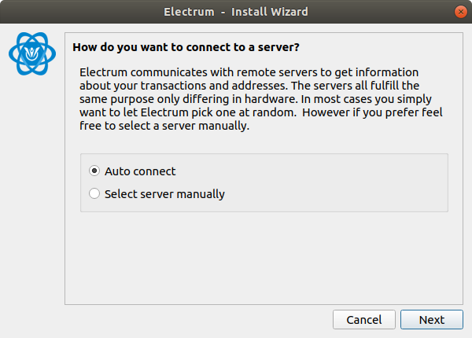
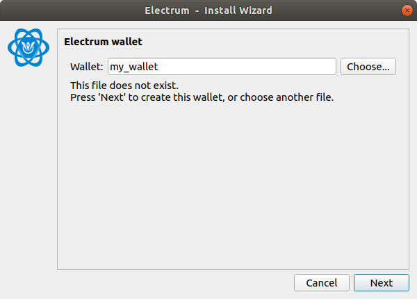
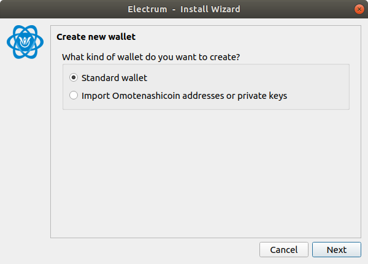
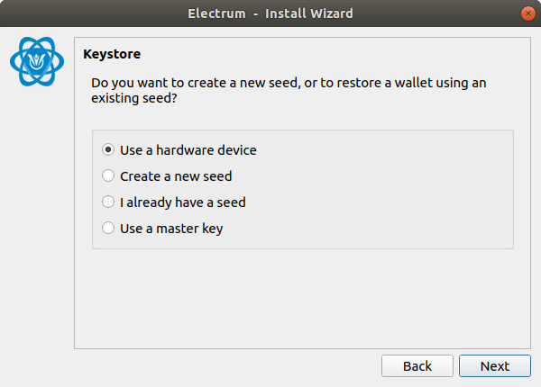
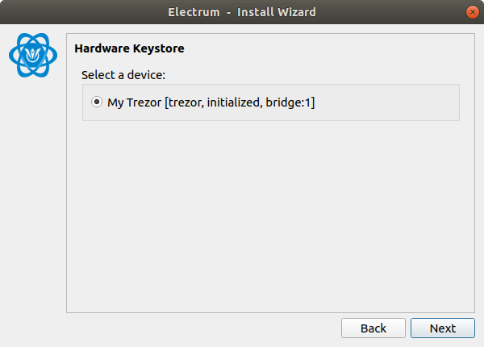
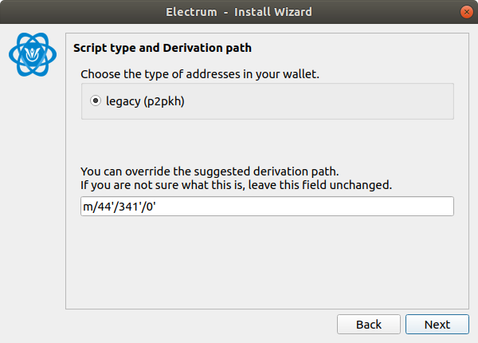
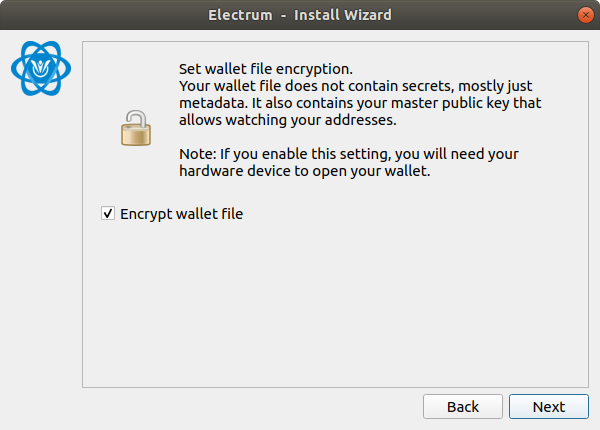
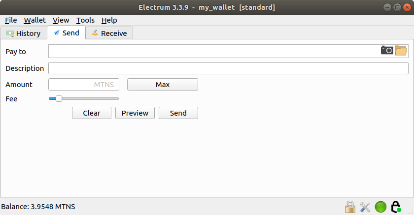
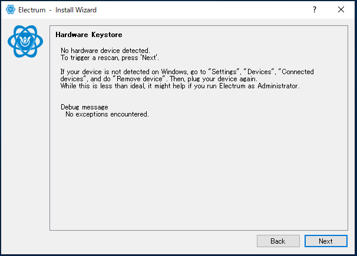
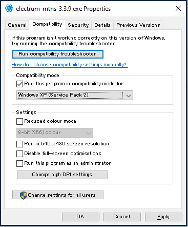

# HARDWARE WALLET CLIENT GUIDE

## TARGET AUDIENCE
This guide is for users who use a hardware wallet with Electrum-MTNS wallet Lightweight Omotenashicoin client.  
This page details how to use the Electrum-MTNS .  

## OUTLINE
Install the OmotenashiCoin formware in your hardware wallet in advance.  
When updating the firmware, transfer the crypto assets in the hardware wallet to another wallet.  
Download the client for your OS.  
Select the legacy type and you are ready to use your hardware wallet.  

## UPDATE FARMWARE YOUR DEVICE
Click here for the firmware update procedure.  
Trezor :   
Ledger :   
Keepkey : [MTNS Firmware Keepkey](http://users-manual.org/hardware_firmware_keepkey/ "MTNS Firmware Keepkey")

## INITIAL SETTING
If you do the initial setup using the official client, please refer to the various manufacturer sites.  
** Official site URLS **  
Trezor : [Official Trezor page](https://trezor.io/start/ "Official Trezor page")  
Ledger : [Official Ledger page](https://www.ledger.com/start/ "Official Ledger page")  
Keepkey : [Official Keepkey page](https://keepkey.shapeshift.com/get-started/ "Official Keepkey page")  

However, if you want to use Electrom-MTNS for initial setup, see here.  
** MTNS user's manuals URLS **  
Trezor : [MTNS Trezor page](http://users-manual.org/hd_trezor_wallet/ "MTNS Trezor page")  
Ledger : [MTNS Ledger page](http://users-manual.org/hd_ledger_wallet/ "MTNS Ledger page")  
Keepkey : [MTNS Keepkey page](http://users-manual.org/hd_keepkey_wallet/ "MTNS Keepkey page")  


## INSTALL CLIENT WALLET
ex) to connect Trezor wallet on Ubuntu Linux.

### Download Electrum-MTNS binary file.
```
$ wget https://github.com/omotenashicoin-project/OmotenashiCoin-HDwalletbinaries/raw/master/stable/electrum-mtns-3.3.9-x86_64.AppImage
$ chmod +x electrum-mtns-3.3.9-x86_64.AppImage
```

### Connect your hardware wallet to your PC.

### To run Electrum-MTNS.
```
$ ./electrum-mtns-3.3.9-x86_64.AppImage
```

### Setup Wizard Initial Settings
1. Select Auto connect.  
You select Auto connect because the host to connect to is already registered in Electrum-MTNS.  
  
2. Input your wallet name.  
A wallet file is created with the name entered here.  
This is the name that is referred when managing multiple wallets with one Electrom-MTNS.  

3. Select Stantard wallet.  
If you are using a new wallet, this choice is sufficient.  
On the other hand, if you want to import from another wallet, select the import instruction.  

4. Select Use a hardware device.  
To use the keystore in the hardware wallet, select hardware device.  
It is also possible to create a new seed on this screen.  

5. Select a hardware wallet connected to your PC.  

6. Select legacy.  
Omotenashicoin supports only p2pkh.  
Other addresses type are not supported.  

7. Finally, select whether to encrypt the wallet from the checkbox.  

8. Display the initial screen.  


## FAQ

### About the general
1. address types  
Q : Which address types are supported ?  
A : only p2pkh. do not supported p2wpkh and  p2wpkh-p2sh.  

2.  to support multiple hardware wallets  
Q : Does a single Electrom-MTNS wallet support multiple hardware wallets ?  
A : Yes, After connecting the other Hardware wallet, you can click [File]-> [New / Restore] and add along the setup wizard.  

### For windows
1. Hardware wallet device not found.  
Q : Hardware wallet device not found  
  
A : This can be avoided by changing the compatibility mode of Windows.  
select Electrom-MTNS.exe and Right-click and click Properties.  
select WindowsXP(Service pack 2 ro 3)   



### For Linux
N/A

### For MacOS
* not supported. coming soon ...


