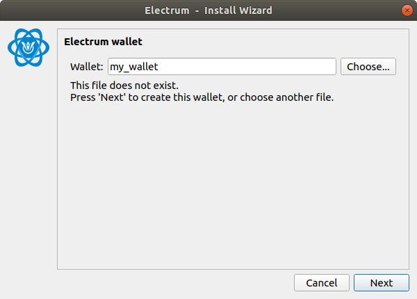
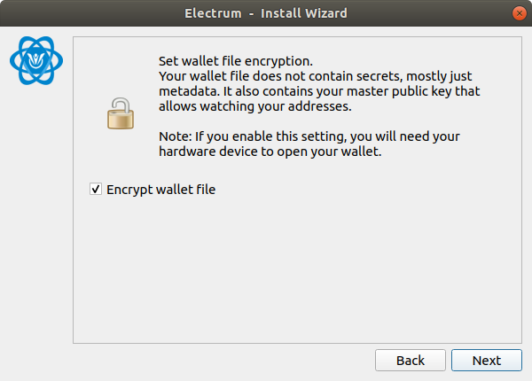

# HARDWARE WALLET CLIENT FOR KEEPKEY GUIDE

## TARGET AUDIENCE
This guide is for users who use a Keepkey hardware wallet with Electrum-MTNS wallet.

## OUTLINE
Install the OmotenashiCoin firmware for keepkey in your hardware wallet in advance.  
When updating the firmware, transfer the crypto assets in the hardware wallet to another wallet.  
Click here for details on [installing keepkey firmware](http://users-manual.org/hardware_firmware_keepkey/ "installing keepkey firmware").  
This page mainly describes how to use the Keepkey device.

## INITIAL SETTING
This section describes the configuration steps immediately after installing the MTNS keepkey firmware.  

### Download Electrum-MTNS binary file.
```
$ wget https://github.com/omotenashicoin-project/OmotenashiCoin-HDwalletbinaries/raw/master/stable/electrum-mtns-3.3.9-x86_64.AppImage
$ chmod +x electrum-mtns-3.3.9-x86_64.AppImage
```

### Connect your hardware wallet to your PC.

### To run Electrum-MTNS.
```
$ ./electrum-mtns-3.3.9-x86_64.AppImage
```

### Setup Wizard Initial Settings
connect Keepkey device on your PC.


1. Select Auto connect.  
  
2. Input your wallet name.  
A wallet file is created with the name entered here.  
This is the name that is referred when managing multiple wallets with one Electrom-MTNS.  

3. Select Stantard wallet.  

4. Select Use a hardware device.  

5. This appears when a Keepekey device is found.  
If the screen is different and you are using Windows, [please refer to this page](http://users-manual.org/hd_client_wallet/#about-the-general "please refer to this page").

6. Initialize setting
Click Next button.  
  
Click Next button.  
If you want to use more words, select 24words.
   
7. set PIN code and get seed charactors.  
go to your keepkey device.  
If you press and hold the button on the keepkey body,  
the [▲] image on the screen changes to [ ﾚ ] and the screen moves to the next screen.  

  
go to Electrum-MTNS on your PC   
Map the display contents of the device and the area displayed by Electrum,   
click the button of the corresponding location, and register the PIN code.  
ex) if you want to input 1 and 5, The mapping with 1, 5 is like this.  
  
  
go to your keepkey device.  
press and hold the button on the keepkey body.  


8. Select legacy.
Omotenashicoin supports only p2pkh.
Other addresses type are not supported.

9. Finally, select whether to encrypt the wallet from the checkbox.


## HOW TO TRANSFER MTNS ASSETS
This section describes the procedure for transferring MTNS.
This asset transfer is a state where the MTNS asset already exists in the hardware wallet.

### transferring MTNS other address
1. Open the Electrum-MTNS wallet, and send tab clicked.  
Input Pay to address and amount, then click Send button.  
Perform the procedure while checking your Electrum-MTNS and Keepkey Device.  
  
  
  
If you press and hold the button on the keepkey body,   
the [▲] image on the screen changes to [ ﾚ ] and the screen moves to the next screen.  
  
your PC  
  
press and hold the button on the keepkey body.  
  
your PC  
  
press and hold the button on the keepkey body.  
  
your PC  
  

Transferring MTNS success.

