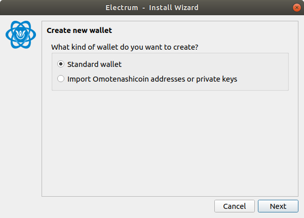
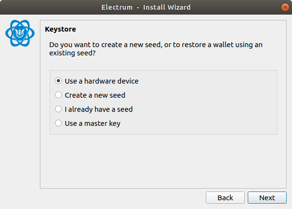
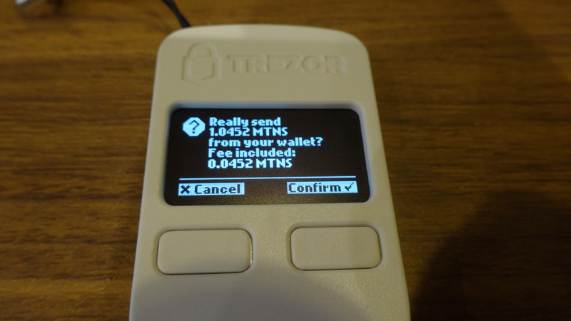

# HARDWARE WALLET CLIENT FOR TREZOR GUIDE
## TARGET AUDIENCE
This guide is for users who use a Trezor hardware wallet with Electrum-MTNS wallet.

## OUTLINE
Install the OmotenashiCoin firmware for trezor in your hardware wallet in advance.  
When updating the firmware, transfer the crypto assets in the hardware wallet to another wallet.  
Click here for details on [installing trezor firmware](http://users-manual.org/hardware_firmware_trezor/ "installing trezor firmware").  
This page mainly describes how to use the Trezor device.

## INITIAL SETTING
This section describes the configuration steps immediately after installing the MTNS trezor firmware.  

### Download Electrum-MTNS binary file.
```
$ wget https://github.com/omotenashicoin-project/OmotenashiCoin-HDwalletbinaries/raw/master/stable/electrum-mtns-3.3.9-x86_64.AppImage
$ chmod +x electrum-mtns-3.3.9-x86_64.AppImage
```

### Connect your hardware wallet to your PC.

### To run Electrum-MTNS.
```
$ ./electrum-mtns-3.3.9-x86_64.AppImage
```

### Setup Wizard Initial Settings
1. Connect Trezor device on your PC.

2. Input your wallet name.  
A wallet file is created with the name entered here.  
This is the name that is referred when managing multiple wallets with one Electrom-MTNS.  

3. Select Stantard wallet.  

4. Select Use a hardware device.  

5. This appears when a Trezor device is found.  
If the screen is different and you are using Windows, [please refer to this page](http://users-manual.org/hd_client_wallet/#about-the-general "please refer to this page").

6. Initialize setting
Click Next button.  
  
Go to your Trezor device.  
Push the right button on the trezor body.  

Go to Electrum-MTNS.  
  
Click Next button.  
If you want to use more words, select 24words.
   
7. set PIN code and get seed charactors.  
go to your trezor device.  

go to Electrum-MTNS on your PC   
Map the display contents of the device and the area displayed by Electrum,   
click the button of the corresponding location, and register the PIN code.  
ex) if you want to input 6 and 9, The mapping with 6, 9 is like this.  
  
go to your trezor device.  
Push the right button on the trezor body.  
These 12 keywords are very important. Keep it in a safe place.  


After displaying the 12 keywords, you need to check the 12 keywords again.  
Press the right button again.  
8. Select legacy.
Omotenashicoin supports only p2pkh.
Other addresses type are not supported.

9. Finally, select whether to encrypt the wallet from the checkbox.
  
Opened top window.


## HOW TO TRANSFER MTNS ASSETS
This section describes the procedure for transferring MTNS.
This asset transfer is a state where the MTNS asset already exists in the hardware wallet.

### transferring MTNS other address
1. Open the Electrum-MTNS wallet, and send tab clicked.  
Input Pay to address and amount, then click Send button.  
Perform the procedure while checking your Electrum-MTNS and Trezor Device.  
  
Push the right button on the trezor.  
The screen will display the amount you have entered.  
  
your PC wallet.  
  
Push the right button on the trezor.  
The fee is displayed on the screen.  
  
your PC wallet.  
  
Push the right button on the trezor.  
The screen will show the total amount and fee entered.  
  
your PC wallet.  
  
  
Transferring MTNS success.

