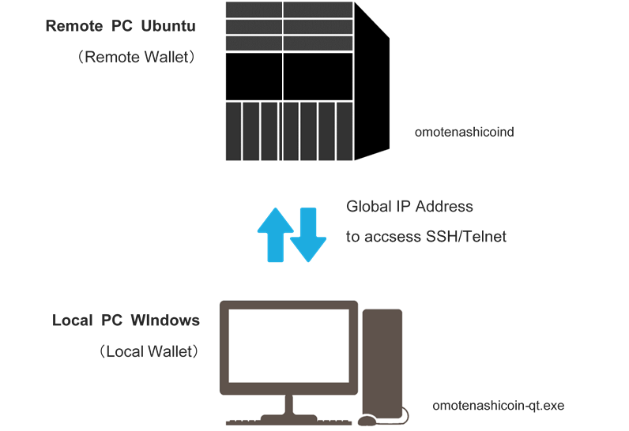
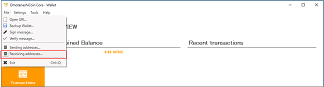
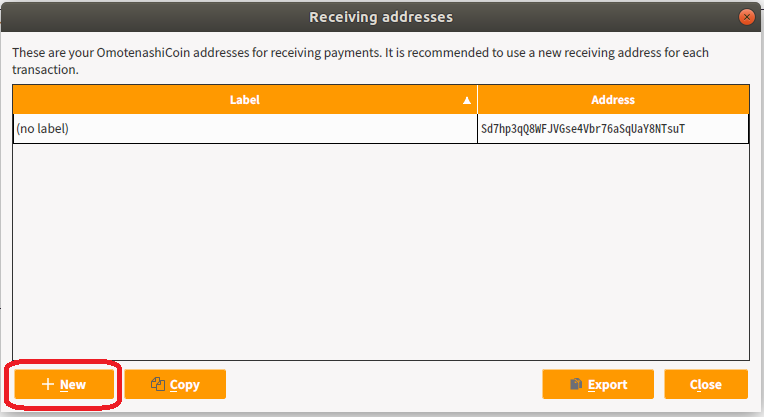
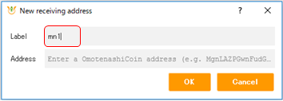
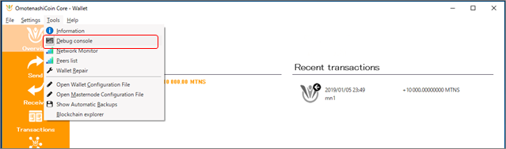
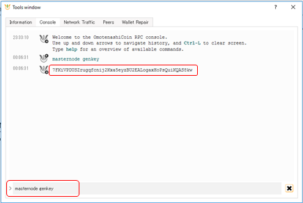
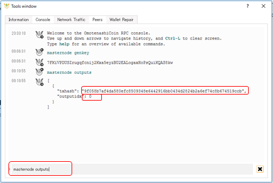
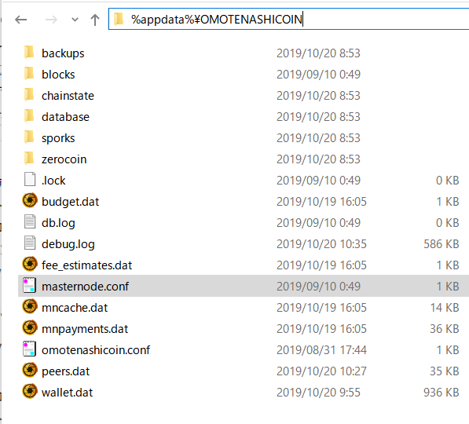
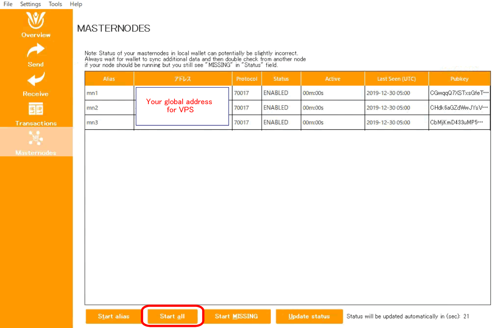

# MASTERNODE SETUP GUIDE

## PREPARATION
This guide describes the procedure for setting up the masternode.  
When setting up the master node, please check the following:  
- Holds 10000 Omotenashi Coin  
- Local PC: Wallet (Windows 10 environment) for saving Omotenashi Coin launches  
- Remote PC: VPS Ubuntu Linux 16.04

## OVERALL VIEW


## STEP 0 : PREPARATION
If your wallet is running, to exit.  
Register the following contents in% appdata% \ OMOTENAHICOIN \ omotenashicoin.conf:  

```text
enablezeromint=0
zeromintpercentage=0
```


After registration, start wallet again.
## STEP1 : LOCAL WALLET CREATE ADDRESS FOR MASTER NODE
1.From the Windows 10 wallet menu, select [File] -> [Receiving address] .  



2.Specify [mn1] for the label and create a new address.  
NOTE: The label name created here will be used in the following settings  
  



## STEP 2 ： MONEY WILL BE SENT TO THE ADDRESS (MN 1)
1.From another wallet or a local wallet, you remit 10000 MTNS to the newly added address (mn 1)  
2.You will wait until the transferred information is approved (around 15 minutes)  

## STEP 3 ： GENERATE A MASTER KEY IN THE LOCAL WALLET
1.Select [Tools] -> [Debug console] and open the debugging console.  


2.Enter the following command
```text
masternode genkey
```
Write down the execution result.  
NOTE: This is the masternode genkey we will use later in the setup  


## STEP 4 ： CHECK OUTPUT OF MASTER NODE
1.Enter the following command from the debug console:
```text
masternode outputs
```
Write down the execution result.  



## STEP 5：WRITE THE MASTERNODE SETTING IN THE CONF FILE
1.Shut down Wallet
2.Go to the data directory (% appdata% \ OMOTENASHICOIN) and add the following line to masternode.conf.  

Example)  
NOTE: The following content is described on one line.
```text
mn1 139.12.115.195:12181 7FKiVPDUSZrugqfcnij2Kxa5eyzBU2EALogaxHoPsQuiKQAS8kw 9f058b7af4da580efc8509348e6442916bb0434d2824b2a6ef74c8b674519ccb 0
```
Setting up the local wallet (on Windows) is finished.  
Next, set up the remote wallet (on Ubuntu Linux).  

## STEP 6 ： INSTALL OMOTENASHI COIN CLIENT ON UBUNTU LINUX
1.Install the latest version of Omotenashi Coin module on Ubuntu VPS.  
view [VPS registration registration and setting](#vps-registration-registration-and-setting)

2.Edit omotenashicoin.conf in the data directory.
```text
mkdir ~/.omotenashicoin
vi ~/.omotenashicoin/omotenashicoin.conf
```
3.Add the following line:  
NOTE: do not need ‘<’ and ‘>’ in following line. change YourUsername and YourPassword.
```text
rpcuser=< YourUsername >
rpcpassword=< YourPassword >
enablezeromint=0
zeromintpercentage=0
rpcallowip=127.0.0.1
listen=1
server=1
daemon=1
logtimestamps=1
maxconnections=64
masternode=1
externalip=< VPS global ip address >
bind=< VPS global ip address >
masternodeaddr=< VPS global ip address >:12181
masternodeprivkey=< Step3(2) input genkey command result value >
```

## STEP 7 ： START MASTERNODE
1.Launch the local wallet.  
2.Enter the following command on the local wallet debug console:
```text
startmasternode alias false <label name of address of masternode>
```
Example) label name of address of masternode : mn1  
When executed, the following will be displayed:  
```text
“overall” : “Successfully started 1 masternodes, failed to start 0, total 1”,
“detail” : [
{
“alias” : “<Name of your masternode>”,
“result” : “successful”,
“error” : “”
}
```

3.Start masternode on the remote wallet.
```text
./omotenashicoind -daemon
./omotenashicoin-cli startmasternode local false
```
After about an hour, the message "masternode started normally" is displayed.

4.Check the status of the masternode on the remote wallet.
```text
./omotenashicoin-cli masternode status
```
The following items are displayed:
```text
{
“txhash” : “49012766543cac37369cf3813d6216bdddc1b9a8ed03ac690221be10aa5edd6c”,
“outputidx” : 1,
“netaddr” : “< your VPS ip address >:12181”,
“addr” : “< your wallet address >”,
“status” : 4,
“message” : “Masternode successfully started”
}
```
The setup of Masternode is finished.  

## Appendix
### How to set up multiple master nodes
This section describes how to start multiple master nodes.  
Assumptions:  
Set three master nodes in one Windows wallet.  
Prepare VPS environment of 3 bases.  


#### STEP 1 : LOCAL WALLET CREATE ADDRESS FOR MASTER NODE
Repeat this procedure three times. Add mn1, mn2, mn3.

#### STEP 2 ： MONEY WILL BE SENT TO THE ADDRESS
Transfer 10000MNTS to addresses mn1, mn2, and mn3.

#### STEP 3 ： GENERATE A MASTER KEY IN THE LOCAL WALLET
Execute the masternode genkey command three times.

#### STEP 4 ： CHECK OUTPUT OF MASTER NODE
The contents of the remittance to mn1, mn2, mn3 in STEP2 will be displayed.


#### STEP 5：WRITE THE MASTERNODE SETTING IN THE CONF FILE
Describe the contents of mn1, mn2 and mn3 in STEP 4.
```
mn1 <1st your global IP for VPS>:12181 <1st masternode genkey command value> <1st masternode outputs command txhash value> <1st masternode outputs command outputidx value>
mn2 <2nd your global IP for VPS>:12181 <2nd masternode genkey command value> <2nd masternode outputs command txhash value> <2nd masternode outputs command outputidx value>
mn3 <3rd your global IP for VPS>:12181 <3rd masternode genkey command value> <3rd masternode outputs command txhash value> <3rd masternode outputs command outputidx value>
```

#### STEP 6 ： INSTALL OMOTENASHI COIN CLIENT ON UBUNTU LINUX
Set STEP6 for each of the three nodes.

#### STEP 7 ： START MASTERNODE
Start Windows Client and click the master node tab.  
The three addresses that have been set are displayed.  
Click the [Start all] button.  
That is all.  



  

### VPS registration registration and setting
For details, refer to [vps_setup](http://users-manual.org/vps_setup/).   
We will use vulter for VPS URL : [https://www.vultr.com/](https://www.vultr.com/?ref=7447858)  

### Automatic setup of Masternode

Coming soon ...

### Canceling Masternode setting
#### Step 1: Stop the master node on the remote wallet

#### Step 2: Delete masternode configuration from local wallet
1. Shut down Wallet
2. Go to the data directory and delete the line created in step 7 from masternode.conf
3. Start wallet again
4. 10000 MTNS will be unlocked


