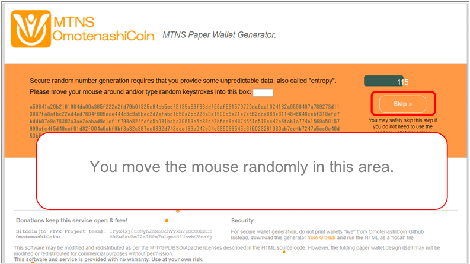
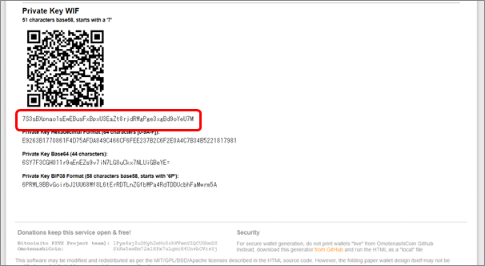

# PAPER WALLET GUIDE

## TARGET AUDIENCE
This guide is for users who use paper wallets.It gives details on how to use a paper wallet.
What is a paper wallet.  
A paper wallet prints a specific address and private key on paper and stores cryptographic assets.  
A paper wallet is a cold wallet and its private key is isolated from the Internet, so it is said to be the safest of all cryptocurrency storage methods.  
On the other hand, because it is stored on paper media, there is a risk that the secret key cannot be read due to paper deterioration due to loss, theft, sunlight and moisture.

## DESIGN AND KEY INFORMATION

## CREATING AND PRINTING A PAPER WALLE
The procedure for printing a paper wallet on paper is described below. You can output the paper wallet to the paper using the procedure from Step 1 to Step 3.

### Step 1: Download the paper wallet generator
1.Download from the following URL .  
[https://github.com/omotenashicoin-project/OmotenashiCoin-Paperwallet/archive/1.0.0.zip](https://github.com/omotenashicoin-project/OmotenashiCoin-Paperwallet/archive/1.0.0.zip)  
If you want to experience the paper wallet as soon as possible,   
please access this link : [OmotenashiCoin Paper wallet for web.](http://paper-wallet.omotenashicoin.site/)  

2.Unzip it to any location on your PC.  

### Step 2: Display html file in browser
1.After unzipping, open the [generate-wallet.html] file in your browser.  
It is the top screen for creating paper wallets.  

### Step 3: Paper wallet printing
1.Move the mouse randomly in the window displayed in the browser.   
If you want to skip this operation, click the [skip] button on the right side of the window.  

2.After generating the key, the paper wallet print screen will appear.  
Click the [2.PrintFront] tab.  

3.Click [Print Wallet Front] button to print Front Image.  

4.Click the [3. Print Back] tab.  
Reinsert the front page paper into the printer and click the [Print Wallet on Back] button to print the back side . If the front and back sides do not match, you will need to adjust using [Zoom] and [Horizontal Shift] on the right side of the screen.  

## HOW TO USE A PAPER WALLE
The following describes how to use the paper wallet. Describes how to use each paper wallet. Please refer to the appropriate section for your use case.

### 1: Transfer assets to paper wallet
Usage scenario: Distributing a printed paper wallet with assets.

1.Transfer the asset to the printed paper wallet.  
It sends assets from the PC wallet to the Public Address.  

2.You use Block Explorer to confirm that the transfer to Public Address is complete.  
This procedure transferred the asset to the paper wallet.  

### 2: Transfer assets from paper wallet to PC wallet
Usage scenario: If you want to move paper wallet assets to a PC wallet

1.It prepares a paper wallet and a PC wallet with assets.  
2.Open the debug window from the PC wallet. Enter the paper wallet private key as an argument to the importprivkey command.  

3.That is the completion of the transfer from paper wallet to PC wallet.  
If your paper wallet has BIP38 Encrypt enabled, you cannot transfer assets using the above procedure.  
You need another procedure. See [4: BIP38 Asset Transfer].  

### 3: BIP38 encryption
Use scene: Used to specify a password and encrypt the private key  
Advantage: Only users who know the password can move assets from the paper wallet, and it is highly confidential when handling assets.  

1.After generating the key in the above step [Step 3-3], you encrypt it on the [2. Print Front] page.  
Click [BIP38 Encrypt].  

2.It will bring up a dialog box for entering the password.  
Enter the password and click [Enable BIP38 encryption].  
Example) Enter "12345"  

3.It displays the password and BIP38 key that you specified when encrypting.  

### 4: asset movement woth BIP38 key
Usage Scene: It moves assets to a PC wallet using a BIP38 enabled key.  

1.Click on the "Validate & keys details" tab and enter your BIP38 encrypted private key.  
Click the "Validate / keys details" button.  

2.In the "Please type in passphrase below:" field, enter the password.  
Click the [Decrypt BIP38] button. After that, the encoding result is displayed at the bottom of the screen.  

3.It scrolls down the screen and you see that the private key of the encoding result is displayed in "Private Key WIF 51 characters base58, starts with a '7'".  
You can then use the private key displayed here to move the asset to the PC wallet (see 2: [Transfer Assets from Paper Wallet to PC Wallet](#2-transfer-assets-from-paper-wallet-to-pc-wallet)).  

#### Error details when the entered BIP38 key and password are invalid
Invalid BIP38 key:  

Invalid password:  

