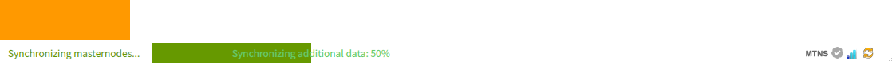

# PC WALLET GUIDE

## TARGET AUDIENCE
This guide is intended for users who use PC Wallet.   
There are two types of networks for managing cryptocurrencies that Mainnet and Testnet.  
This page also describes how to use the wallet on Mainnet and Testnet.  
Note that the explanation below assumes use on Ubuntu linux 64bit.


### Step 1: Download the pc wallet
1.Download from the following URL .  
[https://github.com/omotenashicoin-project/OmotenashiCoin-binaries/raw/master/v1.7.3/omotenashicoin-1.7.3-x86_64-linux-gnu.tar.gz](https://github.com/omotenashicoin-project/OmotenashiCoin-binaries/raw/master/v1.7.3/omotenashicoin-1.7.3-x86_64-linux-gnu.tar.gz)  
if you need other OS wallet, please access this link :   
[OmotenashiCoin wallet on github.](https://github.com/omotenashicoin-project/OmotenashiCoin-binaries/tree/master/v1.7.3)  
2.Unpack it to any location on your PC.  
```shell
mkdir ~/coin
cd ~/coin
wget https://github.com/omotenashicoin-project/OmotenashiCoin-binaries/raw/master/v1.7.3/omotenashicoin-1.7.3-x86_64-linux-gnu.tar.gz
tar xzvf omotenashicoin-1.7.3-x86_64-linux-gnu.tar.gz
cd omotenashicoin-1.7.3/bin/
```


### Step 2: Configure Omotenashicoin config file
1.Create a directory in which to place the configuration file  
2.Create an omotenashicoin.conf file under that directory  
See below for details:  
```
mkdir ~/.omotenashicoin
touch  ~/.omotenashicoin/omotenashicoin.conf
vi ~/.omotenashicoin/omotenashicoin.conf
```
Describe the following lines in the omotenashicoin.conf file.   
*Mainnet configuration :*  
```
rpcuser=username
rpcpassword=password
server=1
listen=1
daemon=1

rpcport=12180
port=12181

addnode=198.13.57.83
addnode=45.32.219.61
addnode=95.179.192.77
addnode=66.42.57.23
addnode=198.13.59.12
addnode=207.148.98.162
addnode=45.76.112.243
addnode=209.250.235.110
addnode=104.238.154.168
addnode=207.246.117.163
```
If you are using Testnet, describe the following line:   
*Testnet configuration :*
```
rpcuser=username
rpcpassword=password

testnet=1

rpcport=12280
port=12281

addnode=66.42.57.23
addnode=198.13.59.12
addnode=207.148.98.162

server=1
listen=1
daemon=1
```


### Step 3: Starting wallet
1.Start the file decompressed in Step1.  
Execute the following command in the GUI environment to start PC Wallet.  
```
cd ~/coin/omotenashicoin-1.7.3/bin/
./omotenashicoin-qt
```
2.Splash window and main screen  
*Splash window for Mainnet*  


*Splash window for Testnet*  


*Main window*  


### Step 4: MTSN send and recive
1.Send MTNS  
Click [Send] from the tab on the left, and enter the remittance address and amount.


2.Recive MTNS  
Click [Receive] from the tab on the left to display the QR code of the address to receive.  
Your address is set in the QR code.   
Present the QR code to the remittance partner and use this QR code when requesting a remittance.


## FAQ
1.What does the indicator at the bottom of the main screen mean?  
When synchronizing with network block data, the following information is displayed.  


After synchronizing with network block data, check other functions.  


A check mark appears when synchronization is complete.  
When transferring funds, keep the wallet running until the synchronization is completed.  


2.How do I create a MTNS address?  
Click ReceiveAddress from the menu.  
  

A list of addresses will be displayed.  


Enter the heading name of the address.  


Click the OK button to register.  


3.I use Testnet, but the synchronization may not be completed. why ?  
Since Testnet does not always mine, the block may not be generated and the synchronization may not be completed.   
If you always want to complete synchronization, you need to mine for Testnet.   

4.What is the default folder when omotenashiocin.conf file is placed?  
Linux:
`$HOME/.omotenashicoin/`  
Windows:
`%appdata%\OMOTENASHICOIN`  
MacOS:
`$HOME/Library/Application Support/OMOTENASHICOIN/`  

Read the settings in omotenashiocin.conf under the above folder.  
If you do not change the folder, create omotenashiocin.conf under the above folder.


