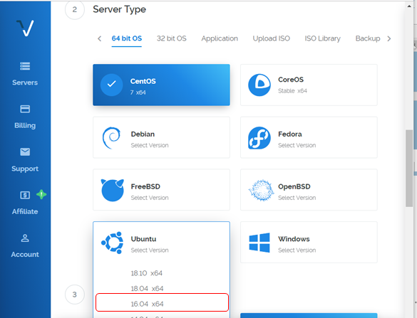

# VPS SETUP GUIDE

## STEP.0 : PREPARATION
This guide describes the procedure for setting up VPS.  
To start Omotenashi Coin service on VPS, refer to the following procedure.  
VPS uses Vultr. You can register from [https://www.vultr.com](https://www.vultr.com/?ref=7447858).  
You register your account from the Vultr top screen.  


## STEP1 : SERVER SELECTION
1.After logging in, select [Servers] from the left side of the screen and click the [+] button.  


2.Select Server Location.  
NOTE: it is recommended that the server select the country that you use or the country that is close in distance.  


3.Select ServerType.  
to select OS: Ubuntu and for version 16.04.  


4.Select the server size.  
NOTE: If you are building Masternode, we recommend a $ 5 environment with 1 CPU / 1024 MB of memory (however, it is necessary to create a SWAP file like a [Appendix](#appendix-how-to-create-a-swap-file)).  


5.Enter Hostname and Label and click Deploy Now.  


This completes the server selection. The environment selected after about 30 minutes for deployment is available.
Next, connect at the terminal.

## STEP2 : CONNECT TO TERMINAL
1.Download the terminal client software.  
Example) PuTTY  
　 [https://www.chiark.greenend.org.uk/~sgtatham/putty/latest.html](https://www.chiark.greenend.org.uk/~sgtatham/putty/latest.html)  
2.After the VPS Deploy is completed, display the server created from the [Servers] menu and select the server to connect.  


3.Scroll the screen and enter the IP address, Username, Password into the terminal software and connect. By clicking [ File image ], the target information is saved on the clipboard.  
Also, when building as Masternode, please use this as the IP address of the remote wallet.  
The procedure for connecting to the VPS server is over.  


## STEP3 : HOW TO INSTALL OMOTENASHICOIN CORE ON VPS
1.Download OmotenashiCoin Core bynary file and unpack tar file.  
```
mkdir ~/mycoin
cd ~/mycoin
wget https://github.com/omotenashicoin-project/OmotenashiCoin-binaries/raw/master/v1.7.2/omotenashicoin-1.7.2-x86_64-linux-gnu.tar.gz
tar xzvf omotenashicoin-1.7.2-x86_64-linux-gnu.tar.gz
```

2.Create data file dir and put config file .  
```
mkdir ~/.omotenashicoin
cd ~/.omotenashicoin
vi omotenashicoin.conf
```

3.Input those line to your omotenashicoin.conf  
```
rpcuser=<any your username>
rpcpassword=<any your password>
rpcport=12180
port=12181
addnode=66.42.57.23
addnode=198.13.59.12
addnode=207.148.98.162
addnode=45.76.112.243
addnode=209.250.235.110
addnode=104.238.154.168
addnode=207.246.117.163
server=1
listen=1
daemon=1
```

4.firewall setting  
```
sudo apt install ufw
sudo ufw allow ssh
sudo ufw allow 12181
sudo ufw logging on
sudo ufw enable
```


5.Start Omotenashicoin Core  
```
cd ~/mycoin
./omotenashicoin-1.7.2/bin/omotenashicoind
```

## Appendix : How to create a swap file
<br/>
1.It creates a swap 4Gbyte file in /var/swap.  

```text
$ sudo mkdir /var/swap/
$ sudo dd if=/dev/zero of=/var/swap/swap0 bs=2M count=2048
$ sudo chmod 600 /var/swap/swap
```  

<br/>
2.It allocates a swap file for swap space.  

```text
$ sudo mkswap /var/swap/swap0
$ sudo swapon /var/swap/swap0
```  

<br/>
3.It enables swap space at OS startup and that all.  

```text
$ sudo vi /etc/fstab
It adds the following to the last line of the fstab file:
/var/swap/swap0 swap swap defaults 0 0
```  

